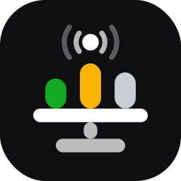
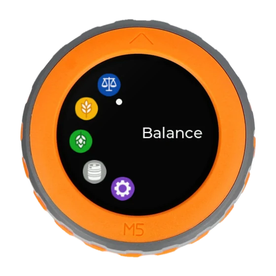

  

# Ultimate Homebrewing Scale (UHS)

[English](README.md) | Français

Ultimate Homebrewing Scale est une balance de brassage connectée à construire
soi-même autour du M5Stack Dial. Elle lit vos recettes Brewfather et guide
chaque pesée, des malts aux ajouts de houblon, et remplit vos fûts au poids.

  

## Ce qu'elle fait

- **Balance** : une balance simple avec tare, pour tout ce qui n'est pas dans
  une recette.
- **Malt** : pèse les malts d'un brassin Brewfather, un par un.
- **Houblon** : pèse chaque ajout de houblon et les répartit dans des
  contenants numérotés.
- **Fût** : remplit un fût au poids et ferme une électrovanne 12 V quand il
  est plein (relais et vanne en option).
- **Config** : un portail de configuration sur smartphone pour le Wi-Fi,
  Brewfather, les fûts, les mises à jour et la sauvegarde de la configuration.

Tout se pilote avec la molette et son bouton ; l'application se met à jour par
le Wi-Fi, et une batterie LiPo optionnelle rend la balance portable. Elle parle
français ou anglais, en unités métriques, US ou impériales.

## Documentation

Trois guides, en français et en anglais, à suivre dans l'ordre :

1. [Guide d'installation matérielle](https://bnbbrewers.github.io/UltimateHomebrewingScale/HardwareInstallationGuide/fr/) :
   la liste d'achat, puis l'assemblage et le câblage.
2. [Guide d'installation logicielle](https://bnbbrewers.github.io/UltimateHomebrewingScale/SoftwareInstallationGuide/fr/) :
   installer l'application depuis le navigateur, la connecter au Wi-Fi et à
   Brewfather, calibrer la balance.
3. [Guide d'utilisation](https://bnbbrewers.github.io/UltimateHomebrewingScale/UserGuide/fr/) :
   les commandes, puis chaque app pas à pas.

## Contribuer

UHS tourne sous UIFlow2 / MicroPython sur l'ESP32-S3 du M5Stack Dial.
[ARCHITECTURE.md](ARCHITECTURE.md) (en anglais) explique le choix du matériel,
décrit le fonctionnement interne (séquence de démarrage, politique mémoire,
mise à jour, watchdog et déblocage, veille, format de sauvegarde) et les
outils de développement. Les questions et les bugs se signalent dans les
[issues](https://github.com/bnbbrewers/UltimateHomebrewingScale/issues).

## Licence

Ce projet est sous licence GPL-3.0. Voir [LICENSE](LICENSE).
