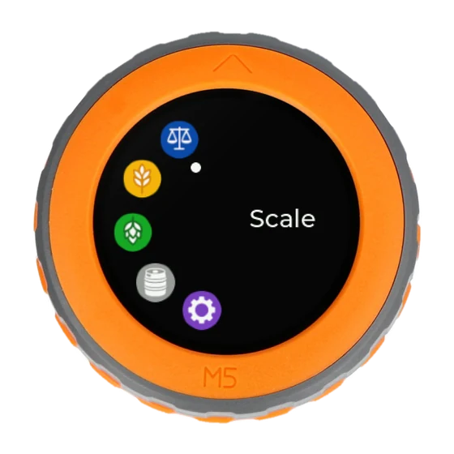

  

# Ultimate Homebrewing Scale (UHS)

English | [Français](README.fr.md)

Ultimate Homebrewing Scale is a connected brewing scale you build yourself
around the M5Stack Dial. It reads your Brewfather recipes and guides every
weighing, from the grain bill to the hop additions, and fills your kegs by
weight.

  

## What It Does

- **Scale**: a plain scale with tare, for anything outside a recipe.
- **Malt**: weighs the grain bill of a Brewfather batch, one malt at a time.
- **Hop**: weighs every hop addition and sorts them into numbered containers.
- **Keg**: fills a keg by weight and closes a 12 V solenoid valve when it is
  full (optional relay and valve).
- **Settings**: a setup portal on your smartphone for Wi-Fi, Brewfather,
  kegs, updates and configuration backup.

Everything is driven from the dial and its button; the application updates
itself over Wi-Fi, and an optional LiPo cell makes the scale portable. It speaks
English or French, in metric, US or Imperial units.

## Documentation

Three guides, in English and French, to follow in order:

1. [Hardware Installation Guide](https://bnbbrewers.github.io/UltimateHomebrewingScale/HardwareInstallationGuide/):
   the shopping list, then the assembly and the wiring.
2. [Software Installation Guide](https://bnbbrewers.github.io/UltimateHomebrewingScale/SoftwareInstallationGuide/):
   install the application from your browser, connect it to Wi-Fi and
   Brewfather, calibrate the scale.
3. [User Guide](https://bnbbrewers.github.io/UltimateHomebrewingScale/UserGuide/):
   the controls, then each app step by step.

## Contributing

UHS runs on UIFlow2 / MicroPython on the ESP32-S3 of the M5Stack Dial.
[ARCHITECTURE.md](ARCHITECTURE.md) covers the hardware choices, the internals
(boot sequence, memory policy, updater, watchdog and lock recovery, standby,
backup format) and the development tools. Questions and bug reports go to the
[issue tracker](https://github.com/bnbbrewers/UltimateHomebrewingScale/issues).

## License

This project is licensed under GPL-3.0. See [LICENSE](LICENSE).
